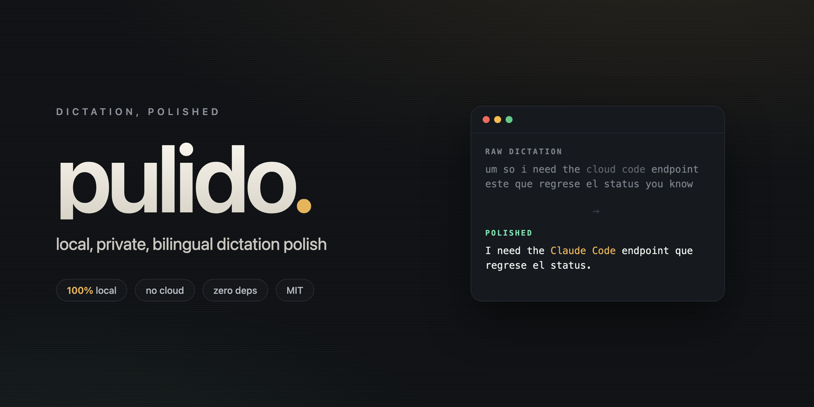
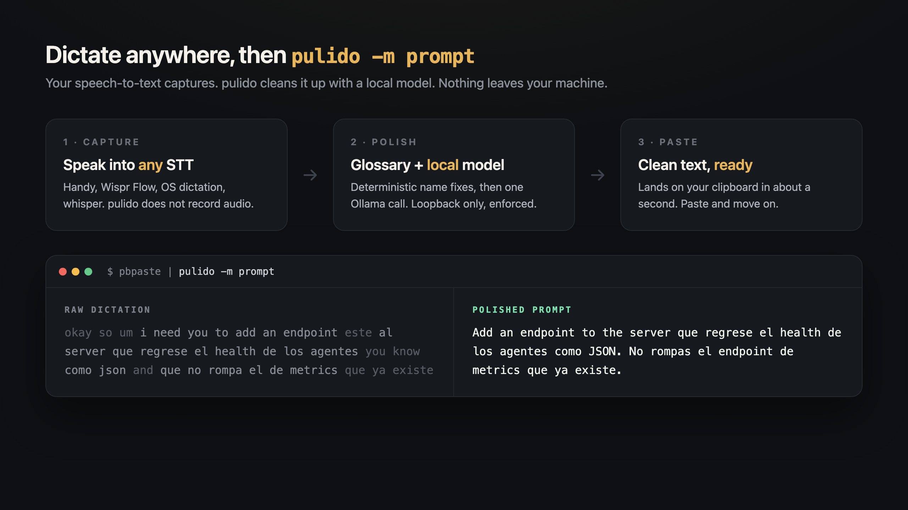

<p align="center">
  
</p>

<p align="center">
  <b>Raw dictation in, clean text out. 100% on your machine.</b><br>
  <sub>Zero dependencies · loopback-only · MIT</sub>
</p>

---

You speak faster than you type. Speech-to-text tools (Handy, Wispr Flow, your OS dictation, whisper) capture that speed, but they hand you raw transcripts: filler words, missing punctuation, "cloud code" instead of "Claude Code", and a mess when you switch languages mid-sentence.

**pulido is the polish layer.** It takes that raw text and cleans it with a small local model, then drops the result on your clipboard. It does not record audio and it never phones home. Your voice stays on your machine.

It was built for a bilingual (Spanish/English) engineer who dictates prompts, chat messages, and notes all day. If that is you, it fills a gap the polished commercial tools mostly ignore.

## How it works

<p align="center">
  
</p>

1. **Capture** with any speech-to-text front end. pulido does not touch your microphone.
2. **Polish**: a deterministic glossary fixes the names your STT always mangles, then one call to a local [Ollama](https://ollama.com) model cleans grammar, punctuation, and fillers.
3. **Paste**: the cleaned text lands on your clipboard in about a second.

## Install

Requires [Ollama](https://ollama.com) running locally and Python 3.8+.

```bash
# 1. get a small model (about 2 GB)
ollama pull qwen2.5:3b

# 2. install pulido (zero Python dependencies)
pipx install git+https://github.com/GerardoRdz96/pulido
#   or:  pip install git+https://github.com/GerardoRdz96/pulido
```

Linux also needs a clipboard tool for clipboard mode: `xclip`, `xsel`, or `wl-clipboard`. macOS and Windows work out of the box. You can always skip the clipboard and pipe via stdin.

## Quickstart

```bash
# clipboard in -> clipboard out (the everyday path)
pulido -m clean

# pipe mode: stdin -> stdout
echo "um so i need the cloud code endpoint you know" | pulido -m prompt

# preload the model so the first call is fast (stays warm 30 min)
pulido --warm

# see every mode
pulido --list-modes
```

## Modes

| Mode | What it does |
|---|---|
| `clean` | *(default)* Minimal cleanup: fix punctuation, drop fillers, keep your words and language mix. |
| `prompt` | Shape rambling dictation into a clear, direct instruction for a coding agent. |
| `teams-es` | Rewrite as a short, warm workplace chat message, entirely in Spanish. |
| `teams-en` | Same, entirely in English. |
| `linkedin` | A social-post draft in a warm, curious-learner voice (no hype, no em dashes). |
| `notes` | Concise Markdown notes. |

## Your own glossary

The built-in glossary fixes common developer terms (`cloud code` → `Claude Code`, `git hub` → `GitHub`, and so on). Add your own names, products, and teammates:

```bash
mkdir -p ~/.config/pulido
cp glossary.example.json ~/.config/pulido/glossary.json
# then edit it — your entries merge over the defaults
```

Or point `PULIDO_GLOSSARY` at any JSON file. Matching is case-insensitive and word-boundary anchored, so short keys will not corrupt longer words.

## One-key dictation (macOS + Raycast)

The `raycast/` folder has ready-made [Raycast](https://raycast.com) Script Commands. In Raycast: Settings → Extensions → **+** → Add Script Directory → pick `raycast/`, then bind a hotkey to **Pulido: Clean**. Your loop becomes: dictate → select + `⌘C` → hotkey → `⌘V`.

Any launcher works the same way (Automator Quick Action, Alfred, a shell alias) — pulido just reads the clipboard and writes it back.

## Privacy

- **Local only.** pulido refuses any non-loopback Ollama URL. Your text is never sent off the machine.
- **No dependencies.** Pure Python standard library. Nothing to audit but one file.
- **No telemetry, no account, no network** beyond your local Ollama.

## Honest limits

- **Language mixing is model-bound.** On small models (3–4B), `clean` mode sometimes pulls a full clause into the dominant language instead of preserving the exact Spanish/English mix. Short fragments and technical terms survive fine; whole-clause fidelity improves with a larger model (`qwen2.5:7b`, `qwen2.5:14b`). This is a limitation of small local models, not a bug pulido can prompt away.
- **Output is a draft.** For `teams-*` and `linkedin`, read before you send. The model can occasionally smooth a phrase in a way you would not.
- **Latency** is roughly 1–2 seconds warm on a 3–4B model, longer on the first call. Use `--warm`.

## Configuration

| Variable | Default | Meaning |
|---|---|---|
| `PULIDO_MODEL` | `qwen2.5:3b` | Any Ollama model. Bigger = better + slower. |
| `PULIDO_OLLAMA` | `http://localhost:11434` | Ollama URL. Loopback only, enforced. |
| `PULIDO_GLOSSARY` | `~/.config/pulido/glossary.json` | Extra glossary, merged over the defaults. |

## License

MIT © 2026 Luis Gerardo Rodriguez Garcia. Contributions and glossary PRs welcome.
